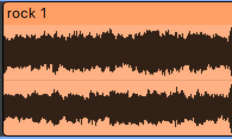

# Desktop DAW MVP Iteration 1 Specification

Status: Draft for implementation.

Date: 2026-10-07.

Scope baseline: [MVP.md](../MVP.md).

Build a desktop digital audio workstation (DAW) that can arrange and mix audio tracks with no fixed track-count limit. Provide a command-line interface (CLI) that validates projects and exports the same mix without graphics or an audio device. This iteration covers the complete MVP; the two-track prototype is an intermediate milestone.

Use ASD-STE100 principles and Plain Language for specifications, technical documentation, and user instructions. Use consistent terms and explicit requirements. In this specification, **must** indicates a requirement. Implementation defaults below resolve routine details within the agreed scope.

## Scope and delivery

| Baseline ID | Required capability |
| --- | --- |
| MVP-01 | Import supported WAV sources and display waveforms. |
| MVP-02 | Add and delete tracks with no fixed track-count limit. Provide gain, pan/balance, mute, and solo. |
| MVP-03 | Move, trim, split, and delete clips without changing source files or allowing overlap on one track. |
| MVP-04 | Provide a timeline, left track list, top playback toolbar, zoom, and scrolling. |
| MVP-05 | Play, pause, stop, seek, and loop a selected range. |
| MVP-06 | Mix tracks with master gain, peak meters, and a clipping indicator. |
| MVP-07 | Use the default output device and handle initialization errors and disconnection. |
| MVP-08 | Save and open folder-based projects with external source references. Preserve missing clips. |
| MVP-10 | Export stereo WAV, including projects with missing sources. |
| MVP-11 | Use a fixed project sample rate of 48 kHz. |
| MVP-12 | Apply short linear fades to clip boundaries. |
| MVP-13 | Validate and export projects through a separate headless executable. |

MVP-09 is retired. Undo/redo is outside this iteration.

The iteration excludes recording, snapping, time signatures, metronome, themes, configurable audio settings, disk audio caches, source inclusion, source manager, track groups, plugins, MIDI, instruments, automation, stem separation, time stretching, and mobile delivery. Keep these features on the roadmap in MVP.md.

## Shared architecture

Use a Cargo workspace with shared libraries and separate desktop and CLI executables. The names below are internal working names.

| Component | Responsibility | Dependency boundary |
| --- | --- | --- |
| daw-core | Project entities, IDs, sample-time types, editing commands, validation | No UI, graphics, device, or file-dialog dependencies |
| daw-engine | Transport, clip scheduling, reusable audio processors, mixing, render state | Depends on core; no file decoding or UI |
| daw-media | Decoder and encoder interfaces, WAV handling, resampling, waveform generation | Supplies PCM assets to the engine |
| daw-project | Manifest serialization, path resolution, loading, safe saving | Uses core and media through explicit interfaces |
| daw-output | CPAL stream, device conversion, callback integration | Desktop device output only |
| daw-ui | Shared panel foundation, controls, timeline, application presentation | Uses shared application commands and state |
| daw-desktop | Desktop entry point and application coordination | Composes UI, output, and shared services |
| daw-cli | Validation and offline export entry point | Uses shared services; excludes desktop dependencies |

A PCM asset contains decoded pulse-code modulation samples. Asset identity must remain separate from its source path and sample storage. Clips reference an asset ID and a range; editing must not copy the underlying samples.

Use composition for reusable processors and UI panels. Share project types and audio processing between playback and export. Do not create a universal base engine. Keep panel framing and reusable controls within the UI layer so the core remains usable without graphics.

Use one reusable toolbar component for the window header, playback toolbar, and Tracks header. Share the panel background, 8-point padding on all sides, 8-point horizontal control spacing, and 22-point control height. A single control row has a 38-point total height. Use the shared text and button theme. Keep section dividers outside the component. The caller supplies controls and layout, including the native macOS window-button clearance and the flexible spacer in the Tracks header.

Use a shared row layout with vertical centering for all control rows and toolbars, including track controls, Master, the status bar, and dialog actions. Reserve the tallest item's height before placing the row's items, so later knobs or controls do not shift the center. Keep the existing row heights, spacing, and panel structure.

Use one reusable application dialog component for unsaved changes, export replacement, and errors. The component must share the title presentation, centered position, 8-point content padding and spacing, non-resizable sizing, wrapped message text, and button layout. Dialog titles must use the standard UI body font: 13-point Outfit. Use a default width of 320 points and a maximum width of 560 points. Button rows must wrap when needed. Each caller supplies its title, message, action labels, action values, and enabled state, then handles the selected action. Keep native file and folder pickers in `rfd`.

### Libraries and build rules

| Purpose | Technology |
| --- | --- |
| Language and build | Stable Rust, edition 2024, Cargo |
| UI and rendering | egui, eframe, eframe's wgpu renderer |
| Command parsing | clap |
| Device output | cpal |
| Decoding | symphonia with WAV and PCM enabled |
| WAV writing | hound |
| Resampling | rubato |
| Callback commands | rtrb and standard atomics |
| Worker threads | Rust standard library threads and channels |
| Manifests | serde and serde_json |
| IDs | uuid |
| File dialogs | rfd; XDG Desktop Portal on Linux |
| macOS menu bar | AppKit through objc2 and objc2-app-kit, in the desktop adapter |
| Errors and diagnostics | thiserror, tracing, tracing-subscriber |

Select compatible released versions at implementation start. Commit Cargo.lock and pin the Rust toolchain used for builds. The CLI dependency graph must exclude egui, eframe, wgpu, rfd, and CPAL. Linux desktop builds require the relevant ALSA development libraries.

## Project model and storage

Each project has one folder:

```text
Project/
  project.json
  assets/
```

The MVP must reference external sources. It must not copy them into assets/. This directory is reserved for future project-owned files. Waveforms and decoded PCM are session data and are not stored in the manifest.

Use the initial JSON structure in MVP.md. The following fields form the MVP data contract:

| Object | Fields |
| --- | --- |
| Project | project_id, name, sample_rate_hz, tempo_bpm, master, assets, tracks, transport |
| Master | gain_db |
| Asset | id, name, source, source_metadata, decoded_frame_count |
| Source | kind, path, path_kind |
| Source metadata | sample_rate_hz, channels, sample_format, bits_per_sample |
| Track | id, name, gain_db, pan, muted, soloed, clips |
| Clip | id, asset_id, name, start_frame, source_offset_frame, length_frames |
| Transport | playhead_frame, loop |
| Loop | enabled, start_frame, end_frame |

schema_version is optional and ignored. Do not branch on its value or reject a file because of it. The format is experimental; migrations and compatibility with earlier experimental manifests are outside this iteration.

### Validation rules

- Require valid UUIDs and unique entity IDs. Track array order defines display order.
- Require sample_rate_hz to equal 48000 at project level. Original source sample rates can differ.
- Store project tempo in tempo_bpm as a positive finite number. Default new projects and older manifests without this field to 120.0 BPM. Tempo is project metadata; changing it does not move clips, change their durations, or stretch source audio.
- Store time values as nonnegative integer frames, using checked arithmetic. One frame contains one sample per channel. All clip offsets and lengths refer to decoded audio at 48 kHz.
- Require finite gain values and pan within [-1, 1]. Validate numeric types without coercing strings into numbers.
- Require source.kind to equal external. Accept relative or absolute path_kind values. Accept pcm_int and ieee_float source sample formats in the supported WAV combinations.
- Require each clip to reference an asset record. Missing asset records are invalid manifests; missing source files are warnings.
- Require positive clip lengths. The saved source offset plus length must fit the asset's saved decoded_frame_count.
- Permit zero or more tracks with no fixed track-count limit in editing or project loading. Track capacity depends on available memory; playback capacity also depends on CPU performance and audio buffer settings.
- Use inclusive starts and exclusive ends. Touching clips are valid; overlapping clips on one track are invalid.
- Require an enabled loop to have end_frame greater than start_frame. Open projects stopped at their saved playhead position.
- Reject malformed JSON, missing required fields, invalid ranges, and unsupported structures with clear errors. Ignore unknown fields while the schema is experimental; their preservation on save is not guaranteed.

### Source paths and saving

Resolve relative source paths from the project folder, never from the process working directory. On save, use a relative path when the platform can express it; otherwise use an absolute path. On Save As, recalculate paths from the destination folder while preserving the referenced file.

Write a temporary manifest in the destination folder. Replace the existing manifest only after the write completes successfully. On failure, preserve the previous manifest, show an error, and keep the project marked unsaved. Do not report a successful save before replacement succeeds.

Prompt Save, Discard, or Cancel before closing or replacing a project with unsaved changes. A failed Save must cancel that transition. Opening a new project must not replace the current project until structural validation succeeds.

### Missing and changed sources

Open projects with missing sources normally. Warn with the affected paths and show empty clips without waveforms. Preserve IDs, names, track placement, source offsets, and clip duration. These placeholders produce silence and remain editable. They occupy timeline ranges under the same overlap rules as other clips.

Check current metadata when opening available sources. If a source has changed and is shorter than the saved ranges, retain the arrangement, warn, and render unavailable portions as silence. Validate saved clip bounds against saved metadata before checking current file length; a changed file must not make an otherwise valid project impossible to open.

Unreadable, malformed, or unsupported existing audio files are processing errors. Do not silently treat those failures as missing files. Do not modify original source audio.

## Import and editing

Accept uncompressed WAV containing 16-bit or 24-bit integer PCM, or 32-bit IEEE float samples. Accept mono and stereo. Reject other encodings and files with more than two channels with a clear error.

Decode sources before playback. Convert their audio to 32-bit floating-point PCM at 48 kHz using Rubato when required. Preserve original channel metadata and source information. Generate waveform peak data on a worker thread. Commit the imported asset and clip only after decoding and placement validation succeed.

Import into a selected track at the playhead. If no track exists, create one for the import. Reject placement that overlaps an existing clip. Import can create a track regardless of the current track count. Keep the interface responsive during import; show progress or an active operation indicator.

| Operation | Behavior |
| --- | --- |
| Move | Change track and/or timeline start without changing source offset or length. Reject negative starts and overlap. |
| Trim start | Change start, source offset, and length together, within source bounds. |
| Trim end | Change length within source bounds. |
| Split | Split strictly inside a clip. Preserve the left ID, create a right ID, and advance the right source offset. Apply normal clip fades to both resulting clips. |
| Delete clip | Remove its arrangement record without deleting source files. |
| Delete track | Remove the track and its clips without deleting source files. |

No snapping is available. Convert pointer positions to the nearest valid integer frame; this precision conversion is not grid snapping. Reject invalid edits and retain the previous valid state. Make live edits visible to rendering at a block boundary without blocking the callback.

## Audio rendering and transport

The engine must render stereo floating-point blocks at 48 kHz. Keep mono sources identifiable so their panning differs from stereo balance. Render silent timeline gaps and missing-source ranges as zeros before export dither.

Use the following render order: source range, clip fade, pan/balance, track gain and audibility, track summation, master gain, peak measurement, final output conversion.

### Mixing rules

- For mono, use equal-power panning. At center, send approximately 0.7071 times the source to each channel; at either extreme, send unity gain to that side and zero to the other.
- For stereo, retain both channels at unity gain at center. Attenuate the opposite channel toward zero at either extreme. Do not transfer its content across channels.
- If any track is soloed, render only soloed tracks, including tracks that are also muted. Otherwise, render unmuted tracks.
- Apply 5 ms linear fades at each clip boundary. At 48 kHz, the nominal fade length is 240 frames. Shorten each fade to half the clip duration for clips shorter than 480 frames.
- Smooth live gain, pan/balance, mute, and solo transitions. Use 5 ms ramps as the initial implementation default; this adds no user setting.
- Preserve floating-point headroom inside the mixer. Measure clipping before final clamping. Clamp device output and integer export to their valid ranges. Do not normalize or insert a limiter.
- Publish left/right master peak values and clipping status without blocking. Provide a visible way to clear the clipping indicator.

Use stable track order for summation. Export must use saved target control values, not a transient live smoothing state. Desktop and CLI export must use the same render and conversion code.

### Transport rules

Play starts at the current playhead and records that position as the playback start. Pause holds the current playhead; Play resumes without replacing the recorded start. Stop ends playback and returns to the recorded start, including while paused or after natural completion. Seek changes the playhead during playback, while paused, or while stopped. Seeking and live plan updates preserve the recorded start until Stop or a new playback after natural completion. Stop before any playback leaves the current position unchanged. The playback start is runtime state and is not stored in the manifest. Seeking, starting, pausing, stopping, and wrapping a loop must avoid unintended discontinuity clicks; use bounded transition handling within the fixed MVP fade policy. Pausing and stopping must hold the playhead even when it is outside an enabled loop.

With looping disabled, stop at the end of the last clip. With looping enabled, repeat the selected range using an exclusive end. Reject empty loop ranges. Disable playback when the project has no clips. If every source is missing but clips exist, playback can run as silence with warnings.

The engine's sample counter drives time and the displayed playhead. Rendering must continue independently of UI frame rate. Process a bounded number of control commands per callback. A full command queue must not block or silently lose an accepted edit; report or retry submission outside the callback.

### Output device and callback

Use CoreAudio on macOS, shared WASAPI on Windows, and ALSA on Linux through CPAL. On Linux, use the system default and its configured PipeWire/PulseAudio bridge.

Prefer a 48 kHz stream and request 512 frames. Select the nearest supported buffer size when available; fall back to the host default when fixed-size requests fail. Callback sizes can vary. If the device requires another sample rate, use preallocated output resampling without changing project timing or export rate.

The callback must not perform file I/O, decoding, allocation, blocking locks, logging, or final asset destruction. Create buffers and converters before starting the stream. Retire replaced assets on a control thread. Offline rendering can use worker-thread allocation and I/O.

On output initialization failure, show an error and keep editing and export available. On disconnection, stop playback safely and report the error. Do not switch devices automatically. A later playback attempt can reinitialize the system default device.

## Desktop interface

Use the supplied Audacity 4 layout references. Provide a simple fixed layout with track controls on the left, timeline lanes on the right, and a toolbar above the timeline.

Use the supplied [visual style reference](assets/style-reference.png) for appearance, while retaining this layout. Use neutral charcoal panels, thin borders, compact flat controls, purple selection and control accents (`#7536A0`), and bundled Outfit. Use muted blue audio clips with light waveforms. Keep these settings in a shared UI style module.

Give the track section the same charcoal background as the toolbar. Extend it through the full workspace height and separate it from the darker timeline with a vertical border. Extend the timeline grid and playhead through the unused space below the tracks.

Use no outer workspace padding or gaps between sections. Track boxes fill the track column width. The toolbar meets the track section and timeline ruler at a single 1-point horizontal divider across the full window width. The ruler meets the track section at its left edge. Track rows and timeline lanes meet at their borders. Keep padding inside controls and track information blocks.

Extend the ruler's bottom divider across the full workspace width, including below the Tracks header. Show this single 1-point divider even when there are no tracks. Do not stack it with the first track's top border.

Selected tracks and clips share a 2-point purple outline with 2-point corner rounding, drawn inside their bounds. Draw the full selected track outline, including the first track's top edge. Keep the shared header divider neutral and the unselected track dividers 1 point thick.

Show one header label in 13-point Outfit: `[project name] - DAW`. Add ` *` after the project name when the project has unsaved changes. Examples: `Untitled - DAW` and `Untitled * - DAW`. Use the same font size throughout the label. Keep the native window title in sync with this text.

On macOS, combine the first toolbar row with the native title bar. Keep the native close, minimize, and full-screen buttons visible and reserve space for them at the left. Allow window dragging from the combined title and unused first-row space. Keep the standard native title bar on Windows and Linux.

Separate the window header from the playback toolbar with a thin horizontal border across the full window width. Give the header and playback row separate, uniform 8-point padding on all four sides. Keep 8-point horizontal spacing between controls. Do not add separators or dividers between playback toolbar items.

Use one transport toggle: Lucide Play while stopped or paused, and Lucide Pause while playing. Update its tooltip and accessibility name to Play or Pause with its state. Use Lucide Square for Stop. Horizontal zoom is anchored to the right edge of the playback toolbar. It uses Lucide's Move Horizontal icon to the left of a 56-point slider with a 4-point rail and a compact round handle. Do not show a numeric value or text label. Use a logarithmic range of 1 to 3000 pixels per second; dragging right increases zoom. Retain tooltips and an accessible slider name. Show transport buttons without visible text labels. Use the shared button style and bundle icons for offline use. Space toggles Play/Pause.

Use a Lucide Repeat icon button immediately after Stop to toggle looping, with no visible text label. Use the shared icon button size and style. Highlight the button when looping is enabled. Give it a Loop tooltip and an accessible on/off state. Keep the loop range display in the toolbar and reject enabling an empty range.

- Align track controls with their lanes during vertical scrolling. Horizontal timeline scrolling must not move the track list.
- Place the horizontal scrollbar inside the bottom edge of the timeline viewport. Keep it there for all track counts and window sizes. Do not use a separate window-wide scrollbar panel. Align it with the timeline, not the track list. Size its thumb to the visible time range and update it when zoom changes. Do not show a numeric scroll input.
- Include an icon-only Add track button using Lucide's Plus icon. Keep the Tracks label on the left and the button on the right, with a flexible spacer between them. Use the playback toolbar's shared 8-point padding on all four sides, with a 22-point control row and 38-point total header height. Retain the Add track tooltip and accessible name. Keep the button enabled regardless of the track count. Use the track information blocks defined below. Provide Delete track in the track context menu.
- Use a 38-point ruler aligned with the Tracks header, with an upper 18-point time-label band and a lower 20-point tick band. Match the supplied [ruler reference](assets/ruler-reference.png) and [selection reference](assets/ruler-selection-reference.png): the toolbar background in the upper time-label band, the timeline background in the lower tick band, a thin horizontal border between bands, taller major ticks, shorter minor ticks, and a muted purple highlight across the selected range in the lower band. Use a softer, darker highlight when Loop is disabled and the stronger highlight when it is enabled. Use 11-point Outfit for time labels. Format major labels as `m:ss`, such as `0:05` and `0:30`; show fractional seconds when zoom requires them. Adjust tick spacing with zoom. Only drags that start in the lower band can create or edit the loop selection. Drags from the upper band must leave the selection unchanged, even if the pointer enters the lower band. Clicking either band can seek. Keep the playhead, clip names, and source waveforms visible. Distinguish missing-source placeholders visibly.
- Include the Play/Pause toggle and Stop button, seek interaction, loop selection/toggle, and horizontal zoom in the playback toolbar. Put master gain, stereo peak meters, and clipping status in the fixed Master block described below.
- Place a BPM label and numeric tempo input after the transport time display. Reuse the track numeric input's size, font, default text color, background, and border. Keep toolbar spacing and vertical centering. Enter or focus loss commits a positive finite BPM value; Escape restores the previous value. Invalid input restores the previous value and reports an error. Mark the project modified only for a changed committed tempo. Disable the input during background operations. Save and restore the tempo with the project.
- Display transport time as `00h00m00.00s` in a fixed-width field. Use bundled Outfit at 13 points. Use semibold weight (600) for all characters. Render digits in the default text color (`#C7C9CC`). Center each digit in an equal-width slot sized for the widest semibold digit. Render `h`, `m`, `s`, and `.` in a slightly darker gray (`#AAAEB3`), with normal character widths. Set the field width to eight digit slots plus the unit and punctuation widths and 8-point padding on each side. Use zero-padded hours, minutes, seconds, and hundredths. Time updates must not move adjacent controls or change digit alignment during playback.
- Put New project, Open, Import WAV, Save, Save as, Export WAV, and Close project in a File menu. Use the native macOS menu bar; use the first toolbar row on Windows and Linux. Use separators between New/Open, Import, Save/Save as, Export, and Close project, following the supplied [menu reference](assets/file-menu-reference.png). Remove the individual file-action toolbar buttons. Show working shortcuts beside each action: Command on macOS or Ctrl on Windows/Linux, with N, O, Shift+I, S, Shift+S, Shift+E, and W respectively. Place Close project last. Closing must stop playback, release the current project and meter state, clear selections and timeline scroll, and return to an empty Untitled workspace without closing the app. For unsaved changes, Save must finish successfully before closing, Discard must close without saving, and Cancel must retain the project. Cancelling or failing a save must retain the project. Route native menu commands through the shared application actions. Preserve unsaved-project and overwrite prompts. Disable file actions during background operations or pending confirmation/error dialogs; disable Export for an empty timeline. No recording or undo controls appear in this iteration.
- Show the selection range at the right edge of the bottom status bar, with a Selection label and start/end times in seconds to two decimal places. Update it from the ruler selection. Keep the playback toolbar's time display for the playhead.
- Show progress for long operations and warnings/errors with affected files or actions. Warnings must not block export with missing sources.
- Reuse panel framing, spacing, styling, visibility, and controls. Panels must submit application commands instead of duplicating project data or accessing the callback.

### Track information blocks

- Show each track as a simple outlined block aligned with its timeline lane.
- Use compact 68-point track rows with no vertical gaps between tracks. One shared 1-point divider separates adjacent track blocks. Do not stack the bottom and top border strokes of neighboring blocks. Clips fill the lane height.
- Place the track name at the top in 13-point regular Outfit. Keep its default text color when selected. Use one row below it in this order: Mute, Solo, gain knob, gain input, pan knob, pan input. Vertically center all six controls within the 28-point control row. Use M and S button labels, with no visible Gain or Pan labels. Retain control tooltips. Fit the name and control rows into a 68-point track height. Keep the meters at the right edge.
- Double-click a track name to replace its label with a centered single-line input in the same name row. Use 13-point regular Outfit and the default text color. Focus the input and select the current name. Enter saves the draft and restores the label; Escape discards the draft and restores the original label. Focus loss keeps the input and draft. Mark the project modified only when a different name is committed. Clear the draft when its track is deleted or the project is replaced.
- Put two narrow vertical L/R level bars at the right edge of each track block, using the [meter design reference](assets/vertical-meters-reference.png). Reuse the master monitor style. Each bar is 8 points wide and fills the 54-point inner block height, with 4 points between bars. Left is first; Right is second. Use a dark background and fill levels from the bottom. Retain channel names in accessibility and tooltips without visible letter labels. Measure each channel after track gain, pan, clip fades, and mute/solo, before master gain. Show a red state when a channel peak exceeds 0 dBFS. Keep a red marker at the top of that bar until the user clicks that channel; clear it when the project closes. Show silence when stopped or when sources are missing. Monitoring must not change the audio or project data.
- Display gain in decibels (dB), with 0 dB as the initial value. Pan ranges from -1.0 (left) to 1.0 (right), with 0.0 as the initial center value. The same Pan field controls stereo balance according to the existing mixing rules.
- Commit numeric input on Enter or focus loss. Invalid input must leave the previous value unchanged and show clear feedback. Escape cancels an uncommitted input change.
- Use the same outlined design for Mute and Solo as the toolbar buttons. Label them `M` and `S`. Use equal button sizes, Mute and Solo tooltips, and full accessible names with on/off states. Show enabled states with the shared purple selection style. Permit both buttons to be enabled; solo overrides mute.
- Use one reusable knob component for track gain, track pan, and master gain, inspired by the [knob reference](assets/knob-reference.png). Use 28-point controls with dark faces, purple value arcs, light pointers, and the shared border and text colors. Put a fixed 0 dB mark at twelve o'clock on gain knobs; put a center mark there on pan knobs. Gain dragging covers -60 to +12 dB, with 0 dB at the midpoint of the sweep; numeric track gain entry retains its existing finite-value validation. Pan ranges from -1 to +1. Drag up or right to increase; hold Shift for fine adjustment. Arrow keys change gain by 0.1 dB or pan by 0.01. Double-click resets to 0 dB or center. Keep numeric entry for precise values. Keep track deletion in the context menu.
- Implement the block as a reusable UI component shared by all tracks.

### Master block

- Show Master as a 68-point outlined block fixed at the bottom of the track column, above the status bar. Use two control rows: the Master name in 13-point regular Outfit, then gain. Retain the audio-track panel frame, padding, typography, and L/R monitor style. Fit the two vertical meters to the 54-point inner height. Use the shared gain knob beside its numeric gain control, without a visible gain label.
- Use only the status bar's thin divider between Master and the status bar. Do not draw a second bottom border on Master or add a gap.
- Keep Master visible during track scrolling, timeline scrolling, and window resizing. Reserve space so audio track controls do not overlap it. Keep audio tracks and their timeline lanes aligned during vertical scrolling.
- Provide master gain and L/R output meters with red clipping markers and click-to-clear behavior. Do not add a separate clipping text row. Retain the current master gain range of -60 to +12 dB. Show meters at zero before output starts.
- Master has no Mute or Solo buttons. It uses the existing master gain and output monitoring; it has no Pan control in this change.
- Use the same numeric input component for track gain, track pan, and Master gain: 36-point width, 11-point Outfit, left-aligned default text color, and the shared input background, border, and padding. Master gain commits with Enter or focus loss and cancels an uncommitted edit with Escape. Retain its -60 to +12 dB range and reject non-finite input.
- Master is the final mix output. It is separate from the audio tracks and cannot hold clips, be deleted, or receive imported audio.

### Clip appearance and interaction



Use the supplied reference for a simple clip block:

- Draw a solid colored rectangle with a thin dark outline and slightly rounded corners. Retain the clip reference's structure; use muted blue fill, a darker header, and light waveforms from the visual style reference.
- Place the clip name at the left of a distinct 22-point header strip, vertically centered with 7-point left padding. Use 11-point Outfit. Clip long names to the available width.
- Fill the body with the waveform. Show one waveform for mono and two stacked waveforms for stereo, with left above right. Use subtle channel backgrounds and a separator between stereo channels.
- Clip the name and waveform drawing to the clip bounds. Timeline zoom changes the visible waveform detail without changing audio.
- Use the header to drag the clip. Use the left and right edges to trim it. Indicate selection with a visible outline and provide cursor feedback for dragging and trimming.
- Missing-source clips retain the same shape, name, and timeline extent. Leave the waveform area empty and show a missing-source label.
- Keep this appearance in a reusable clip component used by every track lane. Do not add per-clip toolbars or embedded audio settings in this iteration.

## Export and command line

Export from frame zero to the greatest clip end, including leading silence and missing-source placeholders. Ignore the transport loop. Reject a project with no clips. Render offline using a snapshot of the project so later desktop edits do not change an export already in progress.

Write stereo, 24-bit integer PCM WAV at 48 kHz. Apply triangular probability density function (TPDF) dither without noise shaping once before quantization. Round to the nearest integer and saturate to the valid 24-bit range. Use a deterministic seed and a reproducible random sequence. Do not include variable timestamps in WAV output. Repeated exports and desktop/CLI exports of the same project must produce identical files on the same build and platform.

Warn before export when sources are missing, but proceed using silence. Warn when the master signal clips. These conditions do not cause export failure. Existing unsupported sources and write/processing errors do cause failure. Write to a temporary output and publish the completed WAV only on success.

The executable name daw-cli is an internal working name:

```text
daw-cli validate --project <folder>
daw-cli render --project <folder> --output <file.wav> [--overwrite]
```

| Condition | CLI behavior |
| --- | --- |
| Valid project | validate returns 0. |
| Missing sources or source shortened | Report warnings to standard error; validation and completed export return 0. |
| Invalid manifest, unsupported audio, or processing failure | Report an error to standard error and return 1. |
| Invalid command arguments | Return 2. |
| Output already exists | Fail unless --overwrite is present. Desktop export requires an overwrite confirmation instead. |

Validation must inspect the manifest and referenced audio, not only JSON syntax. Headless commands must not initialize graphics, dialogs, or audio devices. CLI output must identify missing sources and affected clips. Never overwrite a source file or project manifest as an export destination.

## Verification and acceptance

| Test ID | Verification | Pass condition |
| --- | --- | --- |
| AT-01 | Import each supported sample format in mono and stereo, including a source that requires resampling | Correct source metadata, duration, 48 kHz decoded audio, and waveform; unsupported formats produce clear errors. |
| AT-02 | Create at least eight tracks; save, reopen, play, and export the project in desktop and CLI | All tracks are retained and mixed. Add track stays enabled. |
| AT-03 | Move, trim, split, and delete; attempt overlap and test touching boundaries | Source files remain unchanged; valid edits work; overlaps fail without partial changes. |
| AT-04 | Verify mono pan, stereo balance, mute/solo combinations, gains, fades, and clipping | Results match the mixing rules; solo overrides mute. |
| AT-05 | Start from a nonzero playhead, pause/resume, seek, loop, edit while playing, and stop | Pause holds position; Stop restores the original playback start through seeks and edits; the icon follows Play/Pause state; empty projects cannot play; no unintended clicks or callback blocking. |
| AT-06 | Save/reopen, Save As, cancel an unsaved prompt, and simulate save failure | Project state and source identity survive; failure preserves the previous file and unsaved state. |
| AT-07 | Remove a source, shorten a source, and save/reopen/export | Warnings appear; placeholders and ranges remain; missing audio becomes silence; export succeeds. |
| AT-08 | Repeat exports; compare desktop and CLI output; test overwrite and empty export | Matching WAV bytes on the same build/platform; overwrite policy and empty-project errors work. |
| AT-09 | Build CLI alone and run without a display or audio device | Dependency graph excludes desktop libraries; validation/export succeed. |
| AT-10 | Disconnect the output device and simulate initialization failure | Playback stops safely; editing/export remain usable; clear error appears. |
| AT-11 | Inspect layout and operation on all validation platforms | Track list, lanes, toolbar, waveforms, ruler, playhead, meters, and file dialogs work. |
| AT-12 | Run the reference playback workload | Meet the duration, responsiveness, memory-environment, and dropout criteria below. |

### Validation environments

| OS | Reference hardware |
| --- | --- |
| macOS 27 | MacBook Air M5 and MacBook Pro M4 Pro |
| Windows 11 | AMD Ryzen 7600X desktop |
| Manjaro Linux with GNOME | AMD Ryzen 7600X desktop |

The system memory minimum is 8 GB. Record actual RAM, OS build, audio device, driver/backend, negotiated sample rate, and callback sizes. For Manjaro, record relevant package and GNOME versions. Testing on a machine with more RAM alone does not demonstrate the 8 GB requirement; include an 8 GB environment or document a controlled memory test.

Load four five-minute stereo sources: 20 minutes of decoded audio. At 48 kHz and 32-bit float, source PCM occupies approximately 460.8 MB before other memory. Play all tracks together in a loop for 30 minutes while scrolling, zooming, moving clips, and adjusting gain.

Require no unintended audible gaps or clicks and zero reported output underruns where exposed. Record when underrun counters are unavailable; an absent counter is not evidence of zero underruns. Measure play/seek response and require no more than 50 ms from command submission to audible change on the reference output setup. Buffer duration alone does not establish this latency.

Run cargo fmt, cargo clippy, and cargo test. Use meaningful automated tests for project constraints, mixing, transport, conversion, persistence, and export parity. Combine those checks with the real-device validation above. This specification defines tests; it does not report completed tests.

## Implementation milestones

1. Shared core and persistence: define entities, validators, commands, and the experimental manifest. Build CLI without desktop dependencies.
2. Media and renderer: decode/resample WAV, implement processors and offline rendering, and complete initial CLI validation/export.
3. Two-track prototype: add output, shared panels, waveforms, transport, clip movement, and desktop export. Verify desktop/CLI parity.
4. Complete track editing: implement trims, splits, loop interaction, missing-source handling, safe saves, and errors.
5. Validate the full MVP: run AT-01 through AT-12 on the reference platforms and record results.

The iteration is complete when all applicable acceptance tests pass. Roadmap features do not block completion.
